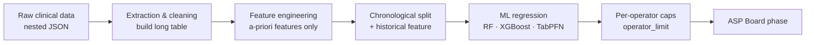

# 🧠 Machine Learning for Rehabilitation Scheduling
### Predicting operator daily assignments to guide an Answer Set Programming solver

---

## 📌 Overview

The **Rehabilitation Scheduling Problem (RSP)** consists of assigning physiotherapy sessions to
patients and operators, and placing them in time and space, while satisfying the many clinical,
logistic, temporal and contractual constraints of a healthcare facility. It is a problem traditionally 
solved with **Answer Set Programming (ASP)**.  As the number of patients, operators and constraints grows, 
the search space explodes and pure ASP becomes impractical. This work presents a **Machine Learning** pipeline 
to estimate how many patients each operator will realistically be assigned in a day. 

---

## 🏆 Related Publication

**The research behind this thesis has been officially published and presented at the 5th International AIxIA Workshop on Artificial Intelligence for Healthcare (HC@AIxIA).** 

> **Machine Learning for Daily Rehabilitation Scheduling Capacity Prediction**
> *P. Bruno, G. Galatà, C. Loria, M. Mammoliti, M. Maratea.*

---

## 🛠️ Pipeline

- **`1-data_preprocessing.ipynb`** — turns the JSON records into a *long* table: one row per
  *(day, operator, category)*, with a-priori features only; chronological split by day and a
  train-only historical feature.
- **`2-exploratory_data_analysis.ipynb`** — distributions, per-category analysis, correlations and
  redundancy (computed on the training set only).
- **`3-predictions.ipynb`** — baseline, Random Forest, XGBoost and TabPFN, with day-grouped
  cross-validation and per-category evaluation.

---

## 👨‍🎓 Author

**Matteo Mammoliti**

- 🏛️ **University:** University of Calabria (Unical) — Department of Mathematics and Computer Science (DeMaCs)
- 🎓 **Degree:** Computer Science (*Informatica*)
- 👨‍🏫 **Supervisor:** Prof. Marco Maratea
- 👩‍🔬 **Co-supervisor:** Dr.ssa. Pierangela Bruno

---

## 📄 License

This project is licensed under the **MIT License** — see the [LICENSE](LICENSE) file for details.
