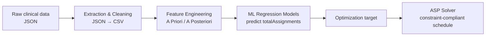

# 🧠 Neuro-Symbolic Optimization of Rehabilitation Scheduling
### Boosting Answer Set Programming with Machine Learning Predictions

---

## 📌 Overview

The **Rehabilitation Shift Scheduling (STR)** problem consists of planning physiotherapy
sessions by assigning healthcare operators to patients on a given day and time slot, while
satisfying the many constraints typical of hospital environments.

Due to its **combinatorial nature**, STR has traditionally been solved with **Answer Set
Programming (ASP)**, which reliably produces constraint-compliant schedules. However, in
real-world settings the search space grows **exponentially** with the number of constraints,
patients, and operators — making pure ASP solutions computationally expensive and, for large
hospitals, impractical.

This thesis tackles that limitation through a **neuro-symbolic approach**: **Machine Learning
(ML)** models, trained on real historical data provided by **ICS Maugeri**, estimate the number
of feasible assignments for a given day. These estimates feed the ASP pipeline as an
**optimization target**, guiding the solver toward efficient solutions and dramatically reducing
the search effort.

---

## 💡 Key Contributions

- **Neuro-symbolic integration** of data-driven ML predictions into a symbolic ASP solver.
- **Robust feature engineering** from raw, nested clinical JSON data, with explicit control of
  **Data Leakage** and **Multicollinearity** to improve generalization.
- **Realistic optimization targets** (`totalAssignments`) that make ASP scheduling tractable on
  large, real hospital instances.
- **Real-world validation** on two ICS Maugeri facilities: **Castel Goffredo** and **Nervi**.

---

## 🛠️ System Architecture

**1. Data Extraction & Cleaning** — transformation of nested JSON into a tabular (CSV) format.

**2. Feature Engineering**
- **A Priori** features (from the `Board` object) — known *before* solving.
- **A Posteriori** features (from the `Agenda` object) — known *only after* solving.
- Data Leakage prevention by removing variables available only once the ASP solver has
  completed the scheduling.

**3. Predictive Modeling** — training regression models to estimate the target variable
`totalAssignments`, later used as the ASP optimization target.

---

## 📊 Results

Models are evaluated separately for each ICS Maugeri facility.

### 🏥 Castel Goffredo

| Model         | MAE | RMSE | R² |
|---------------|-----|------|----|
| Random Forest | TBD | TBD  | TBD |
| XGBoost       | TBD | TBD  | TBD |
| TabPFN        | TBD | TBD  | TBD |

### 🏥 Nervi

| Model         | MAE | RMSE | R² |
|---------------|-----|------|----|
| Random Forest | TBD | TBD  | TBD |
| XGBoost       | TBD | TBD  | TBD |
| TabPFN        | TBD | TBD  | TBD |

---

## 👨‍🎓 Author

**Matteo Mammoliti**

- 🏛️ **University:** University of Calabria (Unical) — Department of Mathematics and Computer Science (DeMaCs)
- 🎓 **Degree:** Computer Science (*Informatica*)
- 👨‍🏫 **Supervisor:** Prof. Marco Maratea
- 👩‍🔬 **Co-supervisor:** Dr. Pierangela Bruno

---

## 📄 License

This project is licensed under the **MIT License** — see the [LICENSE](LICENSE) file for details.
